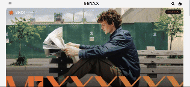

# mixxx-fashion-recommendation
This project is for who concerning about fashion and looking for new clothes.
Put your snapshot or another snapshot in fashion site and you have to choose what your want like color, lenght and style etc.
When this is all over, recommendation clothes will apper as a result.

**Check below for detailed operation instructions and videos.**

<h5> For start </h5>
You need to React and Python to start this code in local.
Also you have to download MIXXX-Ai-tool-of-mixxx and connect with front, back code in this repositoy

<h5>If you ready to start.</h5>
Front -> npm start 
Backend -> uvicorn server:app --reload

# <h3 align="center">Project-overview & Working video</h3>

  

  

